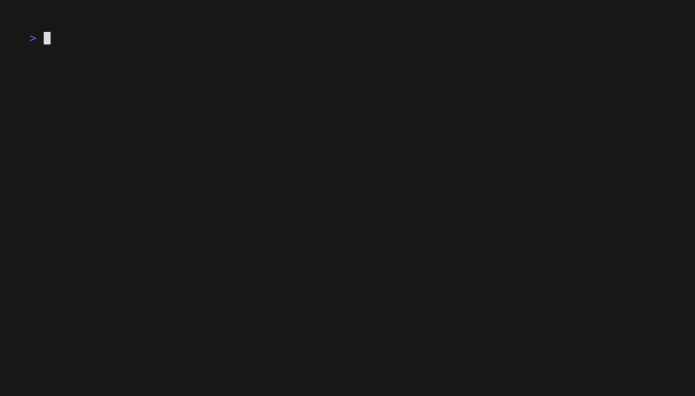

<div align="center">
  <h1>nir</h1>
  <h3>A tool to download or stream torrents from nyaa.si</h3>
  
  
  
</div>

<div align="center">
  
</div>

## ⬇️ Installation

### Download a prebuilt binary

[Latest](https://github.com/sleepytariq/nir/releases/latest)

_or_

### Build from source

```console
git clone https://github.com/sleepytariq/nir
cd nir
go build -ldflags="-s -w" .
```

## ✅ Requirements

- **mpv** or **vlc** video players in [PATH](https://en.wikipedia.org/wiki/PATH_(variable)) for streaming

## 🖐️ Usage

```console
Download or stream torrents from nyaa.si

Usage:
  nir [command]

Available Commands:
  clear       clear cached torrents
  download    download torrents from nyaa.si
  stream      stream torrents from nyaa.si

Flags:
  -h, --help      help for nir
  -v, --version   version for nir

Use "nir [command] --help" for more information about a command.
```
